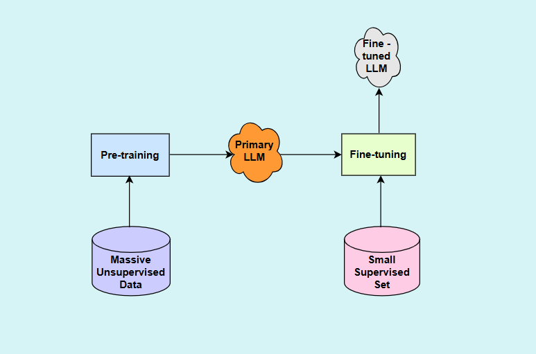

# Bangla Disinformation Detection of Campus News (Jahangirnagar University) and Forensics Profiling of Campus Correspondent and other E-newspapers

This research project focuses on combating disinformation in campus-based Bangla news by developing a sophisticated detection and journalist profiling system. Utilizing **advanced Natural Language Processing (NLP)** techniques, the project fine-tunes **BanglaBERT**, a **Large Language Model (LLM - LLaMA)** pre-trained for the Bangla language, to accurately classify **news content as authentic or false**, achieving an accuracy of **92%**. Evaluated performance using accuracy, precision, recall, and F1-score. A key outcome of this research is the creation of a **dynamic framework for profiling and ranking journalists and their e-news portals based on the authenticity of their reporting**. This ranking system, updated semi-annually, promotes journalistic integrity and ethical reporting. The project's findings contribute to a more trustworthy media environment, with the potential for broader application in the overall journalism landscape.

## Tools and Technologies:

* Natural Language Processing (NLP)
* BanglaBERT
* Large Language Model (LLM - LLaMA)

## Evaluation Metrics:

* Accuracy
* Precision
* Recall
* F1-score

## Human Baseline

## Transformer-based BERT Model

## Large Language Model

## System Architecture

## Dataset File Format

## Sample Data

# Obtained Results

## For Detecting Disinformation

## Final Calssification Report

# Ranking Table for Journalist Profiling

## News publication statistics of Campus Correspondents

## Ranking Table for Journalist Profiling

